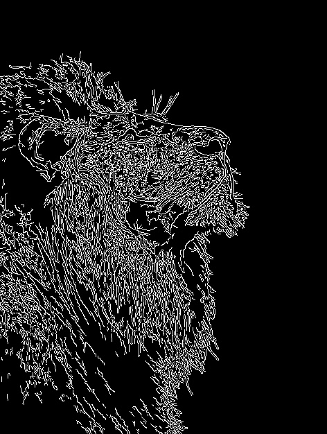
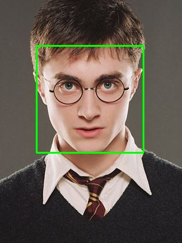

## 1. Processamento de Imagens

### Aplicação: Detecção de Bordas com Algoritmo de Canny (OpenCV)

O Processamento de Imagens tem como foco a manipulação e transformação de dados visuais, operando no modelo onde a **entrada é uma imagem digital** e a **saída é outra imagem modificada**. 

O Filtro de Canny aplica esse princípio para realçar bordas através de quatro etapas sequenciais:

* **1. Suavização Gaussiana (Redução de Ruído):**  
  Câmeras e sensores digitais geram variações aleatórias de brilho (ruídos de alta frequência). O cálculo de derivadas diretamente sobre a imagem bruta interpretaria cada grão de ruído como uma borda falsa. A convolução com um filtro gaussiano borra levemente a imagem para atenuar essas imperfeições antes da análise.

* **2. Cálculo do Gradiente (Magnitude e Direção):**  
  O algoritmo aplica operadores diferenciais (filtros de Sobel) nos eixos horizontal ($G_x$) e vertical ($G_y$). Isso quantifica a taxa de variação de intensidade luminosa entre pixels vizinhos. Regiões com transições abruptas de cor geram magnitudes de gradiente elevadas, apontando candidatos a contorno.

* **3. Supressão de Não-Máximos (Afinamento das Linhas):**  
  O mapa de gradientes inicial produz contornos espessos e difusos. O algoritmo percorre a matriz na direção ortogonal à borda e verifica se o pixel atual corresponde ao pico local de intensidade. Caso contrário, o valor é suprimido (zerado), reduzindo o contorno à espessura de 1 único pixel.

* **4. Limiarização por Histerese (Filtro de Decisão Final):**  
  São aplicados dois limiares de corte (`minVal = 100` e `maxVal = 200`):
  * **Acima de 200:** Pixels classificados como bordas definitivas e consolidadas.
  * **Abaixo de 100:** Pixels descartados sumariamente como ruído de fundo.
  * **Entre 100 e 200:** Pixels aceitos apenas se possuírem continuidade espacial com uma borda forte já validada.

---

### Demonstração Prática

| Imagem de Entrada | Imagem de Saída (Canny) |
| :---: | :---: |
|  |  |
| *Matriz original em escala de cinza* | *Bordas binárias detectadas* |

## 2. Visão Computacional (Artificial)

### Aplicação: Detecção Facial com Classificador Haar Cascade (OpenCV)

A Visão Computacional diferencia-se do processamento básico por focar na **extração de significado e interpretação semântica**. Ela opera sob o modelo onde a **entrada é uma imagem digital** e a **saída são dados estruturados** (coordenadas, classes ou contagens de objetos), permitindo que o sistema compreenda o conteúdo da cena.

O método de Viola-Jones (Haar Cascade) aplica esse princípio para localizar faces por meio de quatro pilares estruturais:

* **1. Características de Haar (Haar-like Features):**  
  Em vez de avaliar valores isolados de pixels, o método calcula a diferença de intensidade luminosa média entre regiões retangulares adjacentes (claras e escuras). Isso permite mapear padrões universais da anatomia facial, como a região dos olhos ser consistentemente mais escura do que a testa e o nariz.

* **2. Imagem Integral (Integral Image):**  
  Avaliar milhares de retângulos em uma imagem exigiria alto custo de processamento. A técnica da imagem integral gera uma tabela de somas cumulativas de pixels pré-computadas, permitindo calcular a intensidade de qualquer área retangular em tempo computacional constante $O(1)$ utilizando apenas quatro referências em memória.

* **3. Seleção com AdaBoost:**  
  Uma única janela de análise pode gerar dezenas de milhares de retângulos possíveis, mas a imensa maioria é redundante. O algoritmo AdaBoost seleciona e treina apenas o subconjunto restrito de características estatisticamente relevantes para distinguir rostos de fundos genéricos.

* **4. Cascata de Classificadores (Cascade Architecture):**  
  Para garantir processamento em tempo real, as características não são testadas todas de uma vez. O algoritmo organiza os classificadores em uma sequência de estágios progressivos: as subjanelas da imagem que não atendem aos critérios básicos do primeiro estágio são imediatamente rejeitadas, reservando o processamento computacional apenas para as regiões promissoras.

---

### Demonstração Prática

| Imagem de Entrada | Imagem com Detecção |
| :---: | :---: |
|  |  |
| *Matriz de entrada contendo indivíduos* | *Bounding boxes $(x, y, w, h)$ extraídas e sobrepostas* |