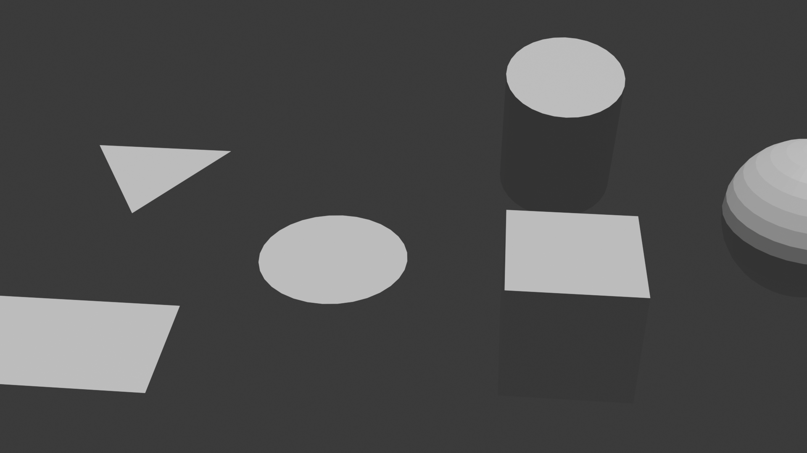
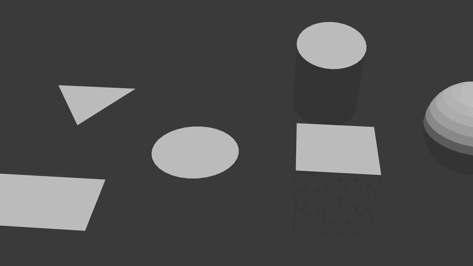

# AC03: Transformações Geométricas 2D e 3D no Blender 4.5 LTS

## 1. Descrição da Atividade e Transformações Aplicadas

Nesta prática foi desenvolvida a cena tridimensional **"Parque Geométrico"**, integrando primitivas bidimensionais no plano cartesiano XY e sólidos no espaço afim 3D por meio de manipulação direta e automação com a API `bpy`.

* **Transformações 2D (Plano XY):** Aplicação de translação linear de coordenadas, rotação pura em torno do eixo $Z$ (preservando a coplanaridade) e escala anisotrópica nos eixos $X$ e $Y$ sobre as primitivas planas (`obj2d_quadrado`, `obj2d_triangulo` e `obj2d_circulo`).
* **Transformações 3D (Espaço Tridimensional):** Sobre os sólidos (`obj3d_cubo`, `obj3d_cilindro` e `obj3d_esfera`), foram executadas translações no eixo vertical $Z$, rotações combinadas em múltiplos eixos (ângulos de Euler) e escalas diferenciais nos eixos $X$, $Y$ e $Z$.
* **Automação vs. Manual:** A hierarquia de coleções (`AC03_transformacoes`), instanciação das primitivas, conversão trigonométrica de rotações e interpolação temporal de keyframes (quadros 1 a 120) foram implementadas via script Python. O posicionamento focal da câmera e iluminação receberam ajustes complementares na interface gráfica do Blender.

---

## 2. Evidências Visuais

| Render Estático (Cena Final) |
| :---: | 
|  |
| *Composição espacial com elementos 2D e sólidos 3D* |
| Demonstração da Animação (Keyframes) |
| :---: |
|  |
| *Translação/rotação 2D e escala/rotação 3D combinadas* |

---

## 3. Respostas das Questões Teóricas

**1. Diferença entre translação, rotação e escala em computação gráfica:** * *Translação:* Operação afim aditiva que altera a posição espacial dos vértices pela soma de um vetor $(t_x, t_y, t_z)$, preservando dimensões e orientação original.
* *Rotação:* Operação linear multiplicativa que gira o objeto em torno de um eixo por um ângulo $\theta$, alterando a orientação angular sem modificar o volume ou as distâncias relativas entre os vértices.
* *Escala:* Operação multiplicativa que redimensiona o objeto aplicando fatores $(s_x, s_y, s_z)$, podendo ser uniforme (mantém proporções originais) ou não-uniforme (provoca deformação anisotrópica).

**2. Diferença entre transformar um objeto no espaço local e no espaço global:** * *Espaço Global (World Space):* Sistema de coordenadas absoluto e estático da cena, indexado a partir da origem fixa $(0, 0, 0)$.
* *Espaço Local (Object Space):* Sistema referencial intrínseco do objeto, centrado em seu pivô (*origin*). Se o objeto rotaciona, seus eixos locais giram conjuntamente; deslocá-lo no eixo $X$ local gera uma trajetória inclinada em relação aos eixos globais do mundo.

**3. Por que rotações em eixos diferentes geram resultados visuais distintos em 3D?** A rotação tridimensional é uma operação **não-comutativa**. No cálculo matricial, a ordem dos fatores altera o produto ($R_x \cdot R_y \neq R_y \cdot R_x$). Rotacionar um corpo primeiro no eixo $X$ e depois no $Y$ produz uma orientação vetorial final diferente da aplicação inversa, princípio que rege o comportamento dos ângulos de Euler e o fenômeno de travamento de cardan (*gimbal lock*).

**4. No Blender, por que usar `math.radians()` ao definir `rotation_euler` via script?** A interface do usuário do Blender projeta leituras em **graus sexagesimais** ($0^\circ$ a $360^\circ$) para conveniência de uso, porém o motor gráfico interno e a biblioteca `bpy` processam rotações analiticamente em **radianos** ($0$ a $2\pi$). A função `math.radians()` normaliza a entrada angular para compatibilidade com as rotinas trigonométricas matriciais ($\text{rad} = \text{graus} \cdot \frac{\pi}{180}$).

**5. Exemplo prático de vantagem do Python sobre transformações manuais:** Automações procedimentais e tarefas com repetições em escala. Exemplos incluem a instanciação de uma malha viária com centenas de postes ajustados automaticamente à topografia do terreno, ou a geração de uma escada helicoidal paramétrica onde cada degrau recebe um incremento fixo de altura em $Z$ e rotação fracionada em torno do eixo central via laço de repetição.