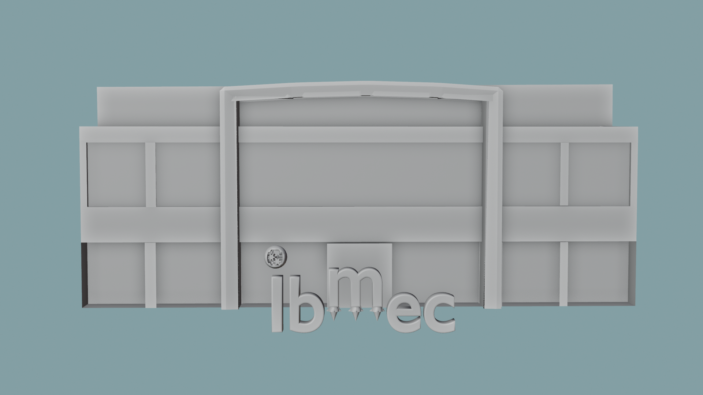

# AP1 — Computação Gráfica: Modelagem e Planejamento da Animação

**Instituição:** Ibmec Barra da Tijuca / Rio  
**Disciplina:** Computação Gráfica (IBM0168/8001)  
**Projeto:** Vídeo Institucional — "Ibmec: Aterrissando no Futuro" (15 segundos)  
**Software:** Blender 4.5 LTS  

---

## Visualização do Modelo (Render AP1)

---

## 1. Documentação e Autoria (1,0 Ponto)

### 1.1. Ideia Geral do Projeto
O projeto apresenta uma animação publicitária de 15 segundos para o Ibmec, mostrando a chegada marcante da instituição no campus da Barra da Tijuca, no Rio de Janeiro. Em vez de deixar as letras paradas em um fundo vazio, o logotipo interage com o próprio prédio da faculdade, trazendo movimento com elementos de tecnologia, engenharia e precisão.

As letras da palavra `Ibmec` foram modeladas com volume 3D e bordas levemente chanfradas, garantindo um visual limpo e profissional.

---

### 1.2. Os Três Objetos Autorais

Todos os três objetos da cena foram modelados do zero para compor a narrativa:

| Objeto | Nome no Blender | O que foi feito na modelagem | Para que serve na história |
| :--- | :--- | :--- | :--- |
| **01. Esfera Mecânica (Pingo do "i")** | `autoral_01_nucleo_esfera` | Esfera oca com recorte frontal, detalhes nas bordas e engrenagens completas modeladas no interior, conectadas para girar juntas. | Funciona como o pingo da letra "i" e representa a inovação, o raciocínio e a engenharia do Ibmec. |
| **02. Sapatos de Foguete da Letra "M"** | `autoral_02_propulsores_m` | Formato cônico com anéis de metal ao redor, bocal de saída na base e chamas modeladas saindo de baixo. | Ficam nos três apoios da letra "m", permitindo que ela desça dos céus e pouse com firmeza no chão como um módulo de alta tecnologia. |
| **03. Prédio do Ibmec Barra** | `autoral_03_predio_ibmec` | Estrutura principal com janelas espelhadas afundadas na parede, entrada monumental com colunas e arco curvado no topo. | É o cenário real onde tudo acontece, dando escala e contexto de mundo real para a chegada da marca. |

---

## 2. Roteiro e Planejamento da Animação para a AP2 (1,5 Ponto)

A animação terá **15 segundos** divididos em quatro partes bem claras:

### Parte 1: O Campus Ibmec (0s a 3s)
* A cena começa mostrando a fachada do prédio do Ibmec Barra sob a luz da manhã.
* As letras "I", "b", "e" e "c" já estão no chão em frente ao prédio, mas o "m" e o pingo do "i" ainda não estão lá. Ouve-se um som de propulsor ao fundo.

### Parte 2: O Pouso do "M" (3s a 7s)
* A câmera sobe para acompanhar a chegada da letra "m", que vem voando do céu com os três foguetes acesos nos pés.
* Próximo ao chão, os propulsores desaceleram a descida e o "m" aterrissa suavemente entre o "b" e o "e", completando a maior parte da palavra. As chamas se apagam.

### Parte 3: O Foco no Pingo do "i" e a Descida (7s a 12s)
* A câmera dá um zoom fechado bem próximo no topo do prédio, onde a esfera mecânica está parada.
* O público vê de perto os detalhes da esfera e as engrenagens internas começando a girar.
* A esfera começa a se mover, desliza pelo arco do prédio e desce pela fachada até quicar e se encaixar com precisão no topo da haste do "I", completando o pingo da letra.

### Parte 4: O Logotipo Completo (12s a 15s)
* A câmera se afasta para mostrar todo o conjunto de frente.
* O logotipo completo do Ibmec brilha com a luz do sol na entrada da Barra da Tijuca, as engrenagens da esfera dão um giro final e a cena fecha com a assinatura institucional da faculdade.

---

## 3. Próximos Passos para a AP2
* **Cores e Materiais:** Aplicar efeito de vidro azul reflexivo nas janelas, acabamento metálico liso nas letras do Ibmec e luz forte/brilhante na saída dos foguetes.
* **Movimentação:** Criar as trajetórias no ar para o voo do "m", a rotação contínua das engrenagens e a descida da esfera até o encaixe final.
* **Luz e Câmera:** Configurar o sol da manhã iluminando a fachada e programar os movimentos da câmera entre os planos abertos e o foco fechado na esfera.